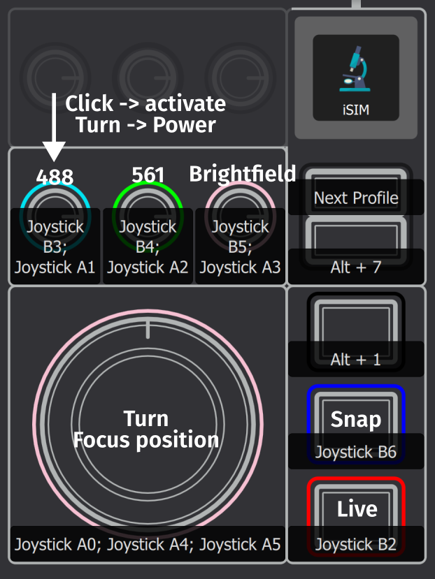

# iSIM Control based in pymmcore-plus
This is the 'new' version of the control software for the iSIM microscope. It's based in pymmcore-plus with some custom components to enable the hardware sequenced control for the iSIM. Overall Structure is described in [Overview](./doc/strucutre_overview.md) with more details in [Structure](./doc/structure.md) and [Communications](./doc/output_comms.md).

# Take your first picture

1. Launch the iSIM-Manager on your desktop.
1. Set EmissionFilter to #NoFilter
1. Choose the channel under Live Channels
1. Hit the live 'Live' button
1. Find the focus (This might be tricky depending on your sample.)
    >There are metal inserts available depending on your sample holder.
    Try to see if one fits your sample. If not, you will have to adjust the screws on the sample stage to get to the correct height (try to ask an experienced user). If nobody is available, be sure to always turn all the screws the same amount (positions on the scerws should be marked to make this easier).
1. Hit the 'Pause' button
1. Hit the 'Save' button in the bottom of the preview window
1. Name the file something.tiff (can then be opened in Fiji for example)

## MDA
1. Hit the MDA button
1. Set up your acquisition
   * The intensities below and the twitcher setting will be specific for the acquisition and can be different from your live mode settings
   * The Filterwheel option should normally not be checked unless in specific situations (e.g. fixed sample with no way to avoid crosstalk)
   * Save name ideally is something like MyData_000, the number in the end will be counted up automatically for subsequent acquisitions
1. Hit 'Run'

# Controller


# Installation
### Assumptions
- Windows PC
- Python 3.11.4 is installed

### Steps

1. Create a folder on the PC called C:\iSIM\.
1. Clone this repository into that folder
1. Generate a uv venv in C:\iSIM\iSIM\control
1. Activate the environment
1. Run uv sync in that folder
1. micro-manager has to be installed. The easiest is to use the CLI
    ```
    mmcore install -d C:\isim
    mmcore use C:\iSIM\Micro-Manager_2.0.3_20250523 #replace with used version
    ```
    >You can use this to install a certain version (20250523 works when this is written)
    `-r, --release TEXT    Release date. e.g. 20210201  \[default: latest-compatible]`

1. Make a shortcut to run C:\iSIM\iSIM\control\main.ps1
1. For each user follow [add new user](../docs/new_user.md)


Logs are here:
C:\Users\~you~\AppData\Local\pymmcore-plus\pymmcore-plus\logs
Settings files per user are here:
C:\Users\~you~\.isim

To change the orientation of the image to match your preference for how the stage should work go to:
C:\Users\your_account\.isim\live_view.json
and adjust the settings there.

# Sample holder
The design for the sample folder is here [Fusion360](https://a360.co/3FxlTVk), [docs/all_holder.stl](../docs/all_holder.stl) and [docs/all_holder.stp](../docs/all_holder.stp)


# Alignment
The alignment procedure has to be used from the old software [Alignment](../gui/README.md#alignment)

# EDA
The system is set up to perform eda acquisition based on [pymmcore-eda](https://github.com/LEB-EPFL/pymmcore-eda). Example files [with](./src/isim_control/eda/basic.py) and [without](./src/isim_control/eda/gui.py) a preview window can be found in the [eda](./src/isim_control/eda) folder. More examples on how to do more complex EDA acquisitions and how to 'close the loop' can be found in the pymmcore-eda repository.