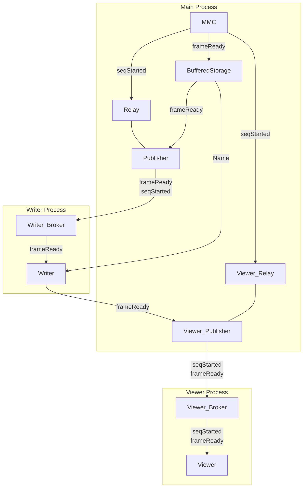

```mermaid
flowchart TB;

    subgraph Main Process
        Publisher
        Relay --- Publisher
        MMC --seqStarted--> Relay
        MMC --frameReady--> BufferedStorage
        BufferedStorage -- frameReady ---> Publisher
        MMC --seqStarted--> Viewer_Relay
        Viewer_Relay --- Viewer_Publisher
    end

    Publisher --frameReady\nseqStarted--> Writer_Broker

    subgraph Writer Process

        BufferedStorage --Name--> Writer
        Writer_Broker -- frameReady --> Writer

        Writer --frameReady--> Viewer_Publisher
    end

    Viewer_Publisher --seqStarted\nframeReady--> Viewer_Broker

    subgraph Viewer Process
        Viewer_Broker --seqStarted\nframeReady--> Viewer

    end

```