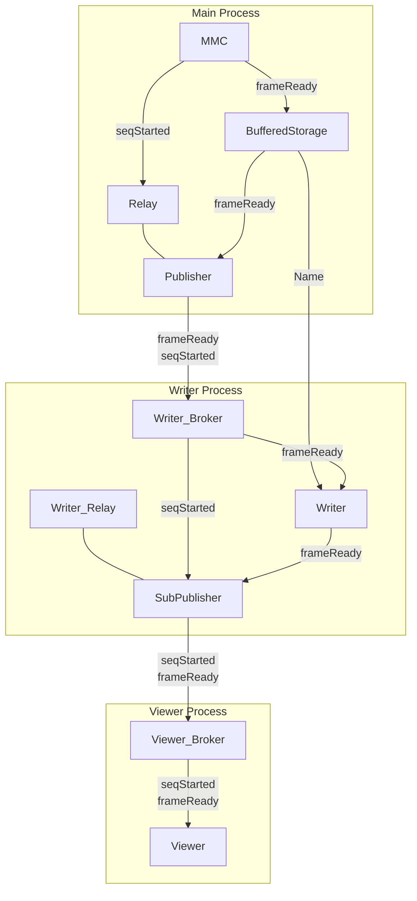

```mermaid
flowchart TB;

    subgraph Main Process
        Publisher
        Relay --- Publisher
        MMC --seqStarted--> Relay
        MMC --frameReady--> BufferedStorage
        BufferedStorage -- frameReady ---> Publisher
    end

    Publisher --frameReady\nseqStarted--> Writer_Broker

    subgraph Writer Process
        Writer_Relay --- SubPublisher
        BufferedStorage --Name--> Writer
        Writer_Broker -- frameReady --> Writer
        Writer_Broker -- seqStarted --> SubPublisher
        Writer --frameReady--> SubPublisher
    end

    subgraph Viewer Process
        SubPublisher -- seqStarted\nframeReady --> Viewer_Broker
        Viewer_Broker --seqStarted\nframeReady--> Viewer

    end

```