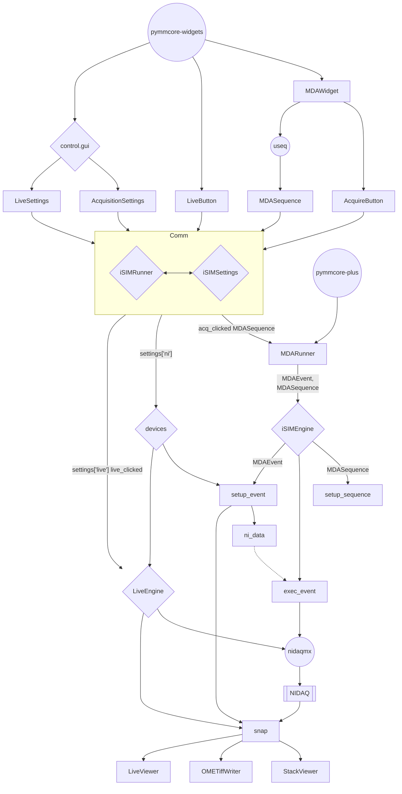

```mermaid
flowchart TB;
    useq((useq))
    pymmcore-widgets((pymmcore-widgets))
    iSIMSettings{iSIMSettings}
    iSIMRunner{iSIMRunner}
    pymmcore-plus((pymmcore-plus))
    iSIMEngine{iSIMEngine}
    control.gui{control.gui}

    subgraph Comm
        direction LR
        iSIMRunner <--> iSIMSettings
    end
    devices{devices}
    NIDAQ[[NIDAQ]]
    nidaqmx((nidaqmx))

    %% Acquisisitons

    useq --> MDASequence
    pymmcore-widgets --> MDAWidget
    control.gui --> AcquisitionSettings
    MDAWidget --> AcquireButton
    AcquireButton --> Comm
    MDAWidget --> useq
    MDASequence --> Comm
    AcquisitionSettings --> Comm


    pymmcore-plus --> MDARunner
    Comm -- acq_clicked MDASequence--> MDARunner
    Comm -- settings['ni'] --> devices


    MDARunner -- MDAEvent, \n MDASequence --> iSIMEngine
    iSIMEngine -- MDASequence --> setup_sequence
    iSIMEngine --> exec_event
    iSIMEngine -- MDAEvent --> setup_event
    devices --> setup_event
    setup_event --> ni_data
    setup_event --> snap
    ni_data -.-> exec_event
    exec_event --> nidaqmx
    nidaqmx --> NIDAQ
    snap --> StackViewer
    snap --> OMETiffWriter


    %% Live Mode
    pymmcore-widgets --> LiveButton
    LiveButton --> Comm
    LiveEngine{LiveEngine} --> nidaqmx
    LiveEngine --> snap
    NIDAQ --> snap
    snap --> LiveViewer

    devices --> LiveEngine
    Comm -- settings['live'] live_clicked--> LiveEngine

    control.gui --> LiveSettings
    pymmcore-widgets --> control.gui
    LiveSettings --> Comm
```