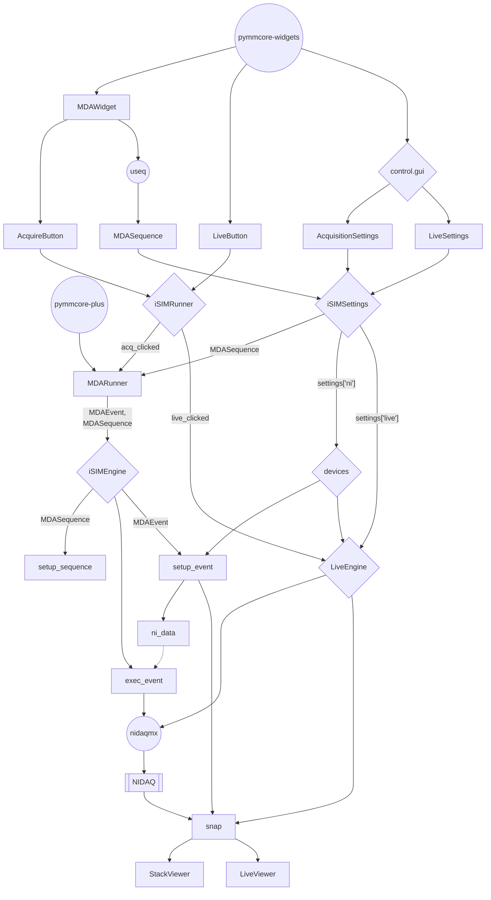

```mermaid
flowchart TD;
    useq((useq))
    pymmcore-plus((pymmcore-plus))
    pymmcore-widgets((pymmcore-widgets))
    iSIMEngine{iSIMEngine}
    control.gui{control.gui}
    iSIMRunner{iSIMRunner}
    iSIMSettings{iSIMSettings}
    devices{devices}
    NIDAQ[[NIDAQ]]
    nidaqmx((nidaqmx))

    %% Acquisisitons
    useq --> MDASequence
    pymmcore-widgets --> MDAWidget
    control.gui --> AcquisitionSettings
    AcquisitionSettings --> iSIMSettings
    MDAWidget --> AcquireButton
    AcquireButton --> iSIMRunner
    MDAWidget --> useq

    MDASequence --> iSIMSettings
    pymmcore-plus --> MDARunner

    iSIMRunner -- acq_clicked--> MDARunner
    iSIMSettings -- MDASequence --> MDARunner
    iSIMSettings -- settings['ni'] --> devices

    MDARunner -- MDAEvent, \n MDASequence --> iSIMEngine
    iSIMEngine -- MDASequence --> setup_sequence
    iSIMEngine --> exec_event
    iSIMEngine -- MDAEvent --> setup_event
    devices --> setup_event
    setup_event --> ni_data
    setup_event --> snap
    ni_data -.-> exec_event
    exec_event --> nidaqmx
    nidaqmx --> NIDAQ
    snap --> StackViewer


    %% Live Mode
    pymmcore-widgets --> LiveButton
    LiveButton --> iSIMRunner
    LiveEngine{LiveEngine} --> nidaqmx
    LiveEngine --> snap
    NIDAQ --> snap
    snap --> LiveViewer

    devices --> LiveEngine
    iSIMSettings -- settings['live'] --> LiveEngine
    iSIMRunner -- live_clicked --> LiveEngine

    control.gui --> LiveSettings
    pymmcore-widgets --> control.gui
    LiveSettings --> iSIMSettings

```