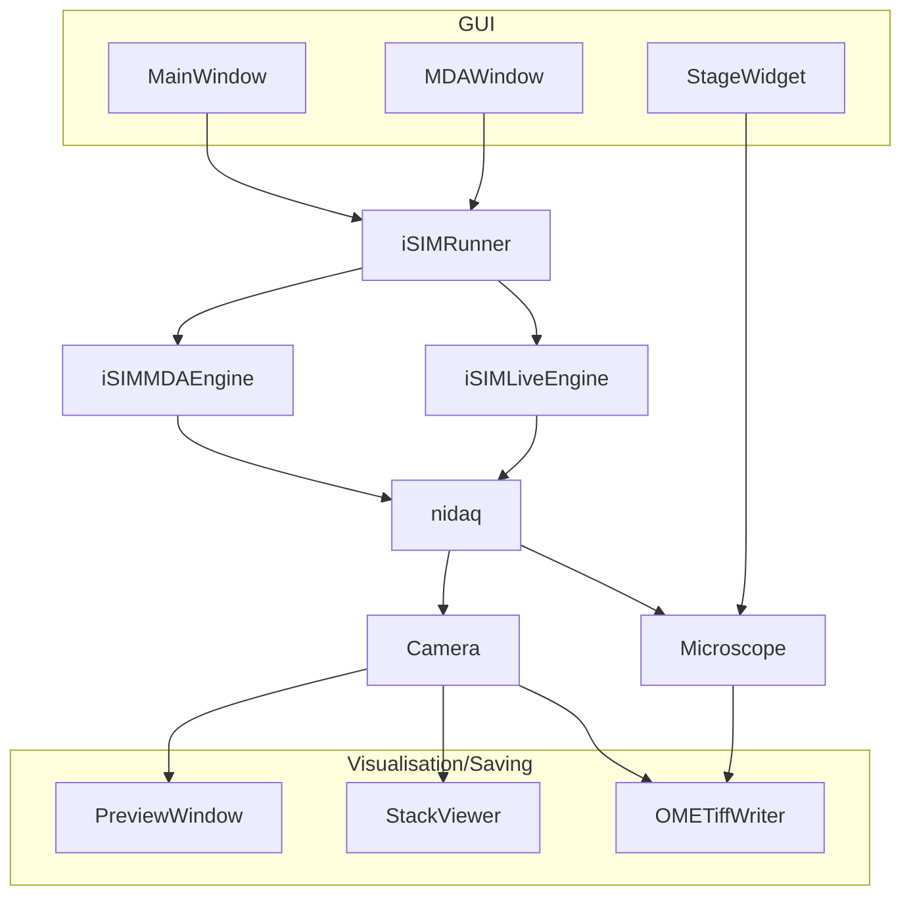

```mermaid
flowchart TB;
    subgraph GUI
        MainWindow
        MDAWindow
        StageWidget
    end

    iSIMRunner

    iSIMMDAEngine
    iSIMLiveEngine

    nidaq

    Microscope
    Camera

    MainWindow --> iSIMRunner
    MDAWindow --> iSIMRunner

    iSIMRunner --> iSIMMDAEngine
    iSIMRunner --> iSIMLiveEngine

    iSIMMDAEngine --> nidaq
    iSIMLiveEngine --> nidaq

    StageWidget --> Microscope
    nidaq --> Camera
    nidaq --> Microscope

    subgraph Visualisation/Saving
        PreviewWindow
        StackViewer
        PreviewWindow
        OMETiffWriter
    end
    Camera --> PreviewWindow
    Camera --> StackViewer
    Camera --> OMETiffWriter
    Microscope --> OMETiffWriter
```